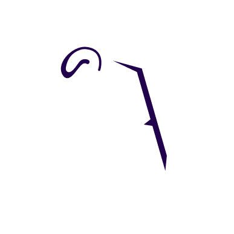

 

# ByteBazaar 


[](https://flutter.dev)
[](https://firebase.google.com/)

**ByteBazaar** is a modern and functional e-commerce mobile application built using the Flutter framework and powered by Firebase for backend services.

## ✨ Features

*   **Modern UI:** Clean and intuitive user interface designed for a seamless shopping experience.
*   **Firebase Integration:** Leverages Firebase for features like authentication, database (Firestore), and potentially more (e.g., storage, cloud functions). *(Note: Specific features depend on further development)*
*   **Cross-Platform:** Built with Flutter, allowing deployment to both Android and iOS from a single codebase.
*   **Scalable:** Designed with scalability in mind, ready to grow with more features and products.

## 🚀 Getting Started

These instructions will get you a copy of the project up and running on your local machine for development and testing purposes.

### Prerequisites

*   [Flutter SDK](https://flutter.dev/docs/get-started/install) (Ensure you have the latest stable version)
*   A code editor like [VS Code](https://code.visualstudio.com/) or [Android Studio](https://developer.android.com/studio)
*   An emulator or physical device to run the app
*   [Firebase CLI](https://firebase.google.com/docs/cli#install_the_firebase_cli) (if you need to manage Firebase resources)
*   A configured Firebase project connected to this app (ensure you have the `firebase_options.dart` and necessary platform-specific configuration files like `google-services.json`).

### Installation & Setup

1.  **Clone the repository:**
    ```bash
    git clone <your-repository-url>
    cd bytebazaar
    ```
2.  **Install dependencies:**
    ```bash
    flutter pub get
    ```
3.  **Run the app:**
    ```bash
    flutter run
    ```
    Select the target device when prompted.

## 🛠 Tech Stack

*   **Frontend:** Flutter
*   **Backend:** Firebase (Authentication, Firestore, etc.)
*   **Language:** Dart

## 🤝 Contributing

Contributions are welcome! Please feel free to submit pull requests or open issues to improve the application.

*(Optional: Add specific contribution guidelines if needed)*

## 📄 License

*(Optional: Specify the license for your project, e.g., MIT License)*

---

*This README provides a basic structure. Feel free to expand it with more details about specific features, architecture, screenshots, or deployment instructions as the project evolves.*
