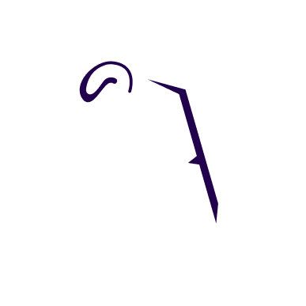

 

# ByteBazaar

[](https://flutter.dev)
[](https://firebase.google.com/)

**ByteBazaar** is a modern and functional e-commerce mobile application built using the Flutter framework and powered by Firebase for backend services.

---

## ✨ Features

* **Modern UI:** Clean and intuitive user interface designed for a seamless shopping experience.
* **Firebase Integration:** Leverages Firebase for features like authentication, Firestore, and more (e.g., storage, cloud functions).
* **Cross-Platform:** Built with Flutter, allowing deployment to both Android and iOS from a single codebase.
* **Scalable:** Designed with scalability in mind, ready to grow with more features and products.

---

## 📽️ Advertisement Video

Watch the promotional video for ByteBazaar on YouTube:
➡️ [Watch on YouTube](https://youtu.be/8byS5JAL2Uw)

---

## 📦 APK Download

Want to try it out? Download the latest APK here:
📥 [Download APK](https://drive.google.com/file/d/1Hw2OlkI_dtSDUpkR-FzATIvtwJitJkJg/view?usp=sharing)

---

## 📑 Proposal Document

Read the project proposal for ByteBazaar for deeper insights:
📄 [View Proposal Document](https://drive.google.com/file/d/1XQ-rZwpyjkH2dDN26LfIbBf0SghXYUix/view?usp=sharing)

---

## 🚀 Getting Started

These instructions will help you set up the project locally for development and testing.

### Prerequisites

* [Flutter SDK](https://flutter.dev/docs/get-started/install) (Latest stable version)
* Code editor like [VS Code](https://code.visualstudio.com/) or [Android Studio](https://developer.android.com/studio)
* Emulator or physical device
* [Firebase CLI](https://firebase.google.com/docs/cli#install_the_firebase_cli)
* Configured Firebase project (with `firebase_options.dart` and `google-services.json`)

### Installation & Setup

1. **Clone the repository:**

   ```bash
   git clone <your-repository-url>
   cd bytebazaar
   ```
2. **Install dependencies:**

   ```bash
   flutter pub get
   ```
3. **Run the app:**

   ```bash
   flutter run
   ```

   Select the target device when prompted.

---

## 🛠 Tech Stack

* **Frontend:** Flutter
* **Backend:** Firebase (Authentication, Firestore, etc.)
* **Language:** Dart

---

## 🤝 Contributing

Contributions are welcome! Feel free to submit pull requests or open issues to improve the application.

---

## 📄 License

Licensed under the MIT License.
